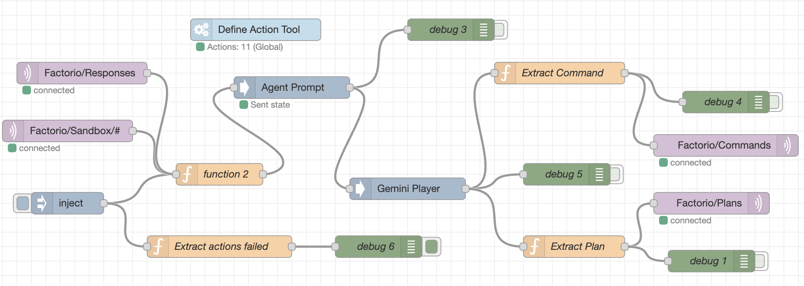

# Factorio Agent 
[ [English](README.md) | [中文](docs/README_zh.md) ]

An AI-based Factorio game agent capable of autonomously analyzing game states and executing operations.
## Project Overview

Factorio Agent is an intelligent agent built using the OpenAI Agent SDK that interacts with Factorio game servers via the RCON protocol. The agent can:

- Analyze game states (player position, resources, inventory, etc.)
- Formulate short-term and long-term strategies
- Execute game operations (movement, building placement, resource collection, etc.)
- Autonomously adjust plans in response to changes in the game

<p align="center">
  
  
</p>

- MQTT workflow in Node-Red also integrated, as you can use agent node in Node-Red rather than OpenAi agent SDK. But it needs a [Factorio MQTT Notify mod](https://github.com/lvshrd/Factorio-MQTT-Mod) installed and `publisher.py` running. If you have installed Node-Red, you can simply import the workflow via a json file [here](docs/Node-Red%20flows.json).
<p align="center">
  
</p>

## Technical Architecture

- **OpenAI API**: Provides AI decision-making capabilities
- **RCON Protocol**: Communicates with Factorio servers
- **Python Asynchronous Programming**: Handles game interactions and AI responses
- **Factorio Runtime API**: Realizes game operations tool functions via Lua Factorio API

## Installation Guide

### Prerequisites

- Python 3.11+
- [Factorio](https://www.factorio.com/) above 2.0 version (Here I use 2.0.32)
- OpenAI API key

### Installation Steps

1. Clone the repository:

```bash
git clone https://github.com/lvshrd/factorio-agent.git
cd factorio-agent
```

2. Create and activate a virtual environment:

```bash
conda create -n factorio_agent_env python=3.11
conda activate factorio_agent_env
```

3. Install dependencies:

```bash
pip install -r requirements.txt
```

4. Configuration:

Rename `config_example.toml` to `config.toml` and fill in your OpenAI API key and Factorio server information:

```toml
[openai]
OPENAI_API_KEY = "your-api-key-here"

[factorio]
server_address = "localhost"
rcon_port = 27015
rcon_password = "your-rcon-password"

[agent]
max_steps = 100
step_delay = 5
```

## Usage

1. Create a new single freeplay game and ensure the Factorio server is running with RCON enabled (When needed, start a Multiplayer game and configure  the RCON port and password in `./config/config.ini` in your game [directory](https://wiki.factorio.com/Application_directory) )

2. **Unnecessary:** Execute any command first to unlock the achievement limit. For example: run test scripts to ensure the RCON connection is working and the Factorio API is accessible by the agent.
```bash
python test/RCON_test.py
python test/interface_test.py
```

2. Run the agent:

```bash
python main.py
```

3. The agent will begin analyzing the game state and executing operations

## Project Structure

```
factorio-agent/
├── api/                      # API-related code
│   ├── __init__.py
│   ├── agent_tools.py        # Agent tool functions
│   ├── factorio_interface.py # Factorio interface
│   ├── sandbox/              # sandbox mode API
│   │   └── base.py
│   └── prototype.py          # Game prototype definitions
├── test/                     # Test code
│   ├── __init__.py
│   ├── RCON_test.py
│   └── interface_test.py
├── config.toml               # Configuration file
├── main.py                   # Main program
└── README.md                 # Project documentation
```

## Customization and Extension

### Adding New Tools

Add new tool functions in `api/agent_tools.py`:

```python
@function_tool
def your_new_tool(param1: str, param2: int) -> str:
    """
    Tool function description
    
    Args:
        param1: Parameter 1 description
        param2: Parameter 2 description
        
    Returns:
        Return value description
    """
    # Implementation logic
    return result
```

Then add the tool to the `factorio_agent` initialization in `main.py`.

### Modifying System Prompts

Modify the `system_prompt` in `config.toml` to adjust the agent's behavior and goals.

## Troubleshooting

### Common Issues

1. **Connection Errors**: Ensure the Factorio server is running and RCON is enabled
2. **API Errors**: Check that your OpenAI API key is correct
3. **Max Turns Error**: Increase the `max_turns` parameter in `Runner.run()`, default is 10

```python
# Modify in main.py
result = await Runner.run(factorio_agent, message, max_turns=20)  # Increase to 20 or more
```

### Logs Example

Check the `factorio_agent.log` file for detailed runtime logs and error information.
```log
2025-03-20 11:09:20,587 - httpx - INFO - HTTP Request: POST https://api.openai.com/v1/responses "HTTP/1.1 200 OK"
2025-03-20 11:09:20,850 - factorio_agent - INFO - Step 7 - Agent response: ### Current Game State
- **Player Position:** (x: -17.5, y: -118.5)
- **Inventory:** 1 wood
- **Nearby Resources:** A large coal deposit surrounding the player

### Analysis
The location features a substantial coal reserve, which can be utilized to fuel basic industries. The inventory is minimal with only one piece of wood, highlighting the need to gather more resources to expand and automate our base operations.

### Next Step Plan
1. **Objective:** Establish a temporary mining setup to begin extracting coal.
2. **Action Plan:**
   - Find available entity prototypes to create a mining drill if materials permit.
   - If the materials allow, place a mining drill on coal and start extraction.

### Actions to Execute
1. Check available prototypes for mining equipment.
2. Decide on extraction setup based on available entities.
```

## License

This project is licensed under the MIT License - see the [LICENSE](docs/LICENSE) file for details.
